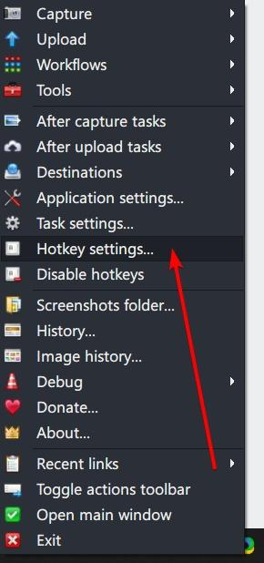
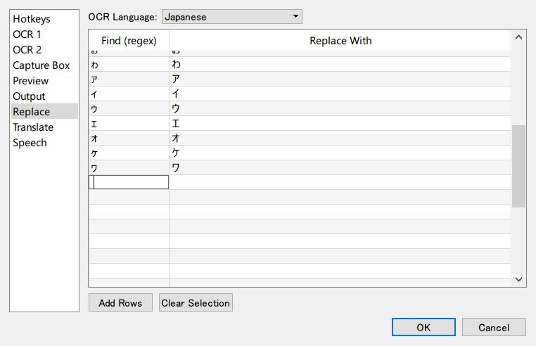

# Stegatxins0's Mining Setup

This simply serves to be a contribution-open version of stegatxins0's popular guide to sentence mining,
because the original guide no longer seems to be maintained.
If stegatxins0 ever sees this, thank you for creating the original guide!

One of the most notable changes this introduced to the Japanese learning community is combining
ShareX with Anki-Connect to automatically export audio and images into the most recently added card.

- **Original site: [https://rentry.co/mining](https://rentry.co/mining)**
- [Un-changed backup of the original](https://github.com/Aquafina-water-bottle/stegatxins0-mining/tree/original)
- This repository wasn't made for nothing. Please feel free to contribute! Anything from simple things like fixing grammatical issues / dead links, to adding new features are all highly appreciated!

> **Note**:
> This is NOT *my* mining setup (mine can be found
> [here](https://aquafina-water-bottle.github.io/jp-mining-note/)),
> but the language used within this guide may still refer to first person.
> This is because the guide was originally written by stegatxins0 himself.


**Requirements**:
- Language that you are learning: Japanese
- Platform: Windows 10


## Anki

### Installing Anki Addons
1. Download the latest version of Anki from [here](https://apps.ankiweb.net/).
1. Install Anki addons. To install addons go to `Tools > Add-ons > Install Add-on` and paste the code.

    List below are the addons that I use:

    - *(MUST HAVE)*  **[Straight Reward](https://ankiweb.net/shared/info/957961234)** - avoid "ease hell" `957961234`
    - *(MUST HAVE)*  **[PassFail JP](https://www.mediafire.com/file/l4d63dqsw75urw9/PassFail_2.1_%2528JP%2529.zip/file)** - get rid of visual clutter `Continue reading if you're wondering how to install`
    - *(MUST HAVE)*  **[AnkiConnect](https://ankiweb.net/shared/info/2055492159)** - add cards with Yomichan `2055492159`
    - *(RECOMMENDED)*  **[Edit Field During Review](https://ankiweb.net/shared/info/1020366288)** - edit definition or hint during review `1020366288`
    - *(RECOMMENDED)*  **[Yomichan Forvo Server](https://ankiweb.net/shared/info/580654285)** - for almost full word audio coverage for your Anki cards `580654285`
    - *(OPTIONAL)* 	**[anki-forvo-dl](https://ankiweb.net/shared/info/858591644)** - batch generate word audio `858591644` `See Kindle section`
    - *(AESTHETICS)*  **[Full Screen Toggle](https://ankiweb.net/shared/info/1612375712)** - `F11` to toggle fullscreen `1612375712`
    - *(AESTHETICS)*  **[Review Heatmap](https://github.com/stegatxins0/review-heatmap/releases/download/v1.0.0-beta.2/review-heatmap-v1.0.0-beta.2-anki21.ankiaddon)** - [heatmap and streak](https://raw.githubusercontent.com/Glutanimate/review-heatmap/master/screenshots/review-heatmap-1.png) (fork of [original addon](https://github.com/glutanimate/review-heatmap) with inverted color for night mode removed) `Download and double click on it`
    - *(AESTHETICS)*  **[Puppy Reinforcement](https://ankiweb.net/shared/info/1722658993)** - make Anki less boring `1722658993`
    - *(AESTHETICS)*  **[True Retention](https://ankiweb.net/shared/info/613684242)** - true retention (you have to hold `SHIFT` before you press on `stats`) `613684242`

#### PassFail JP
1. After downloading, extract it to anywhere.
2. Install the `yumin.ttf` Yu Mincho font.
3. Copy the `PassFail (JP)` folder to `%APPDATA%\Anki2\addons21` (paste this in your file explorer address bar).

#### Puppy Reinforcement (Completely optional)
1. [This](assets/puppy_reinforcement.png) is the image that I use. Download and copy or move it to `%APPDATA%\Anki2\addons21\1722658993\user_files`
2. In Anki, go to `Tools > Add-ons`. Select `Puppy Reinforcement`. Click `Config`.
3. Change `disable_default_images": false,` to `disable_default_images": true,`

### Anki Settings

1. Follow this [site](https://archive.is/jRfSZ) to setup Anki. (follow the `Anki Settings` and `Straight Reward` in `The 'ease' problem`)
1. Download your preferred card template. After downloading, double click on the file and import the card template.

    [This](https://anonfiles.com/51m9s4xcu0/mining_apkg) is my card template, which is a modified version of [animecards](https://ankiweb.net/shared/info/151553357) (also read [this](https://animecards.site/ankicards/)). I don't use this but If you need sentence card template that auto color word based on their pitch accent check out [this](https://ankiweb.net/shared/info/1557722832).

How my card is different than the original animecards:
- different font
- field for pitch accent position
- field for meta/source (see `Kindle` section)
- pitch accent graph moved to above definition
- you can edit definition and hint when reviewing (if you have `Edit Field During Review` installed)
- add option to change [this](assets/efdr_original.jpg) to [this](assets/efdr_changed.jpg) by changing `{kana:Reading}` to `{furigana:Reading}`

## Yomichan
1. Download and install yomichan: [chrome](https://chrome.google.com/webstore/detail/yomichan/ogmnaimimemjmbakcfefmnahgdfhfami), [firefox](https://addons.mozilla.org/en-US/firefox/addon/yomichan/)
1. Download your preferred dictionary pack. I use [shoui Yomichan Dictionaries](https://learnjapanese.moe/monolingual/#getting-and-using-monolingual-dictionaries). The above pack include monolingual, bilingual, frequency, pitch accent and kanji dictionary. Alternatively, you may also download dictionary from [Epistularum's dictionary pack](https://anacreondjt.gitlab.io/docs/dicts/).
1. Click on the Yomichan extension and click on the settings icon. Enable `Advanced` option on the bottom left.
    
1. Click `Configure installed and enabled dictionaries` under `Dictionaries` Import your preferred dictionary. Then, sort the order in `priority`. The higher the number, the higher the position of dictionary. For more information on recommended dictionary see [this](https://learnjapanese.moe/monolingual/#recommended-dictionaries).

1. Enable `Enable Anki integration` and click on `Configure Anki card format` under `Anki` section. Make sure you have Anki opened and `AnkiConnect` addon installed in Anki or read the Anki section.
    |Field|Value|Extra Note|
    |---|---|---|
    |Word|`{expression}`||
    |Reading|`{furigana-plain}`|`{reading}` work too but if you're one of those (not me) who uses handwriting fonts, you can easily set your Anki template to look like [this](assets/handwriting_font.jpg) ([the default one](assets/default_font.jpg)) by changing `{kana:Reading}` to `{furigana:Reading}` in your Anki template|
    |Glossary|`{test}`|`{clipboard-text}` if you want to manually copy definition by `ctrl + c`|
    |Sentence|`{cloze-prefix}<b>{cloze-body}</b>{cloze-suffix}`|`{sentence}` if you don't want to make the main vocab **bold**|
    |Picture||see `ShareX` section|
    |Audio|`{audio}`|leave it empty if use `anki-forvo-dl` to batch generate word audio for those with unstable/poor Internet|
    |SentenceAudio||see `ShareX` section|
    |Graph|`{pitch-accent-graphs}`||
    |Position|`{pitch-accent-positions}`||
    |Hint||manual input|
    |Meta||see `Kindle` section|

1. Click `Configure Anki card templates…` under `Anki` section. Replace all the text with [this](https://pastebin.com/raw/TeSJc6ij).
1. Click `Configure custom CSS` under `Popup Appearance`. Use [my CSS](https://pastebin.com/raw/RxB0CEnS) (modified version of [full-nord-theme](https://learnjapanese.moe/yomicss/#example-full-nord-theme)) or create your own Yomichan CSS [here](https://learnjapanese.moe/yomicss/). Paste your CSS in `Popup CSS`.
1. To use Yomichan on word such as 懇々, Click `Configure custom text replacement patterns` under `Translation`. Click `Add` and fill in with these values:
    Pattern: `(.)々`
    Replacement: `$1$1`
1. Make sure you have `Yomichan Forvo Server` addon installed in Anki. If not see `Anki` section. Click `Configure audio playback sources` under `Audio`. Next to `Custom audio source`, select `JSON` for type and insert `http://localhost:8770/?expression={expression}&reading={reading}` in URL. Click `Add` to add a new row. Order it to look like this: (you can also put `Custom` at first if you prefer) <br>
    
1. Using Yomichan in Yomichan is helpful when reading monolingual definition. Change the following settings:
    - check `Allow scanning popup content` under `Popup`.
    - change `Maximum number of child popups` under `Allow scanning popup content` under `Popup` to `9999`.
    - check `Allow scanning popup source terms` under `Allow scanning popup content` under `Popup`.

1. Change some settings
    - uncheck `Show the welcome guide on browser startup` under `General`
    - set `Scan delay` under `Scanning` to `0`
    - disable `Search text with non-Japanese characters` under `Scanning`
    - set `Scale` under `Appearance` to `150%`
    - set `Size` under `Appearance` to `712` for `Width` and `512` for `Height`
    - check all three styles for `Pitch accent display styles` under `Appearance`
    - uncheck `Show space between parsed words` under `Text Parsing`
    - set `Reading mode` under `Text Parsing` to `None`
    - check `Enable search page clipboard text monitoring` under `Clipboard`

## ShareX
1. Download and install ShareX from [here](https://getsharex.com/).
1. Right click on ShareX icon and click `Hotkey Settings` <br>
    
#### Hotkey for Screenshot
1. Click `add`. Close the windows and select None on the right hand side and define key combination for screenshots. Mine is `F6`
    
1. Click on the settings icon on the left hand side.
    
1. Select `Capture region` for `Task`. You can also select `Capture region (Transparent)`. The difference is `Capture region` freeze screen while `Capture region (Transparent)` does not.
    
1. Check `Override after capture settings`. Uncheck all and check the followings: `Save image to file`, `Perform actions`.
1. Check `Override screenshot folder`. Click `Browse` and select Anki collection media location (usually something following this format `C:\Users\______\AppData\Roaming\Anki2\______\collection.media` ).
1. Insert `anki-screenshot` or anything you want in description .
1. Click on `Image` tab. Check `Override image settings`. Under `Image format` select `JPEG` to save space.
    
1. Click on `Actions` tab. Check `Override actions`. Click `Add`. A new window will pop up. Fill in the following values:
    - **Name**: `anki-screenshot` (or anything you want)
    - **File path**:
        ```ps
        C:\Windows\System32\WindowsPowerShell\v1.0\powershell.exe
        ```
    - **Argument**: (if you're not using my card type, replace `Picture` with your screenshot field name. Use [this tool](http://www.unit-conversion.info/texttools/replace-text/))
        ```ps
        -NoProfile -Command "$medianame = \"%input\" | Split-Path -leaf; $data = Invoke-RestMethod -Uri http://127.0.0.1:8765 -Method Post -ContentType 'application/json; charset=UTF-8' -Body '{\"action\": \"findNotes\", \"version\": 6, \"params\": {\"query\":\"added:1\"}}'; $sortedlist = $data.result | Sort-Object -Descending {[Long]$_}; $noteid = $sortedlist[0]; Invoke-RestMethod -Uri http://127.0.0.1:8765 -Method Post -ContentType 'application/json; charset=UTF-8' -Body \"{`\"action`\": `\"updateNoteFields`\", `\"version`\": 6, `\"params`\": {`\"note`\":{`\"id`\":$noteid, `\"fields`\":{`\"Picture`\":`\"`\"}}}}\"; "
        ```
1. Check `Hidden window` and click `OK`. Close `Task settings` windows.

##### Alternative: add clipboard text to sentence field

If you want your card to be as high quality as possible, you might find yourself opening Anki to edit sentence field and meaning field. The script below will automate the process so that you don't have to open Anki at all.

###### Setup
1. Follow the steps above for [Hotkey for Screenshot](https://rentry.co/mining#alternative-add-clipboard-text-to-sentence-field) but use this code instead.
    ```ps
    -NoProfile -Command "$clipboard = (Get-Clipboard | where{$_ -ne \"\"}) -join \"<br>\"; $medianame = \"%input\" | Split-Path -leaf; $data = Invoke-RestMethod -Uri http://127.0.0.1:8765 -Method Post -ContentType 'application/json; charset=UTF-8' -Body '{\"action\": \"findNotes\", \"version\": 6, \"params\": {\"query\":\"added:1\"}}'; $sortedlist = $data.result | Sort-Object -Descending {[Long]$_}; $noteid = $sortedlist[0]; Invoke-RestMethod -Uri http://127.0.0.1:8765 -Method Post -ContentType 'application/json; charset=UTF-8' -Body \"{`\"action`\": `\"updateNoteFields`\", `\"version`\": 6, `\"params`\": {`\"note`\":{`\"id`\":$noteid, `\"fields`\":{`\"Sentence`\":`\"$clipboard`\", `\"Picture`\":`\"`\"}}}}\"; "
    ```
1. If you're not using my card type, replace `Picture` with your screenshot field name and `Sentence` with your sentence field name. Use [this tool](http://www.unit-conversion.info/texttools/replace-text/)).
1.  In Yomichan settings, click on `Configure Anki card format` under `Anki`. Change value for `Glossary` (or your definition/meaning field) to `{clipboard-text}`.
1. If you find yourself switching between two different script frequentl , instead of copypasting the code every time you switch, you can create a new action by clicking `Add` and `check/uncheck` the one that you `want/don't want` to use.

###### Workflow
1. Manually copy definition from Yomichan with `ctrl + c` or `right click and click copy`.
2. Add card to Anki using Yomichan.
3. Copy the sentence with `ctrl + c` or `right click and click copy`. You can also copy multiple lines.
4. Add screenshot by clicking the hotkey for `Hotkey for Picture` script that you setup earlier. The script will add screenshot to `picture` field and clipboard text to `sentence` field.
5. You can also add sentence audio by clicking the hotkey for `Hotkey for Audio` (continue reading for more details).

###### Troubleshooting
**Sentence field is empty**: make sure you have `copy file to clipboard` disabled in `Override after capture settings`. If you want to copy image to clipboard create a separate hotkey for that.
**AnkiConnect: UnboundLocalError**: don't copy sentence that contains weird symbol such as `"` or `\`. (I might fix this in the future)

#### Hotkey for Audio
1. Click `add`. Close the windows and select None on the right hand side and define key combination for screenshots. Mine is `F7`
    
1. Click on the settings icon on the left hand side.
    
1. Select `Start/Stop screen recording using pre configured region` or  `Start/Stop screen recording using active window region`  for `Task`. I recommend using `pre configured region` so that you can see the recording status in full screen. ShareX have a few seconds of delay before it start recording, when it start recording the dotted line will change from red to green. You cannot see this in full screen, that's why I recommend preconfigured region. The region you select later won't matter if you record audio only without video, because **ShareX record audio from all application in your desktop instead of audio from a specific application**.
    
1. Check `Override after capture settings`. Uncheck all and check the followings: `Save image to file`, `Perform actions`.
1. Check `Override screenshot folder`. Click `Browse` and select Anki collection media location (usually something following this format `C:\Users\______\AppData\Roaming\Anki2\______\collection.media` ).
1. Insert `anki-audio` or anything you want in description .
1. Click on `Capture` tab. Check `Override capture settings`.
1. Click `Select region` under `Capture` tab. Select anywhere in the screen, it doesn't really matter (see explanation above). If you select `active region` in `Task`, you can skip this step.
1. Click on `Screen Recorder` tab. Click on `Screen recording options` and click on Download to download FFMPEG.
    
1. After finish downloading, Click `Install recorder devices`
1. Under `Sources` select `none` for video source and `virtual-audio-capturer` for audio source.
    
1. Change `Audio codec` to `MP3`
    
1. At `Command line preview`, check `Use custom commands` and replace everything in text with the command below to trim silence and normalize the audio.
    ```
    -y -rtbufsize 100M -f dshow -i audio="virtual-audio-capturer" -c:a libmp3lame -af "silenceremove=1:0:-50dB, speechnorm=p=0.5:e=6.25:r=0.0001:l=1" -qscale:a 4 "$output$"
    ```
    (Thanks to [Mansive#0727](https://discord.com/channels/617136488840429598/1110407709876027432/1110411717105684581) and [Quizmaster](https://animecards.site/media/#hotkey-for-audio) for these flags!)
    <details>
    <summary>Alternatives <i>(click here)</i></summary>
    - The original (does not correctly reduce the volume):
        ```
        -y -rtbufsize 100M -f dshow -i audio="virtual-audio-capturer" -c:a libmp3lame -filter:a "volume=0.9" -af silenceremove=1:0:-50dB -qscale:a 4 "$output$"
        ```
         - [Original Source](https://animecards.site/media/#hotkey-for-audio)
    - A fixed version of the above, that properly reduces the volume:
        ```
        -y -rtbufsize 100M -f dshow -i audio="virtual-audio-capturer" -c:a libmp3lame -af "silenceremove=1:0:-50dB, volume=0.9" -qscale:a 4 "$output$"
        ```
        * Thanks to [Mansive#0727](https://discord.com/channels/617136488840429598/778430038159655012/980272369698500609) for this fix!
    </details>
1. Close the window. Click on `Actions` tab. Check `Override actions`. Click `Add`. A new window will pop up. Fill in the following values:
    - **Name**: `anki-audio` (or anything you want)
    - **File path**:
        ```ps
        C:\Windows\System32\WindowsPowerShell\v1.0\powershell.exe
        ```
    - **Argument**: (if you're not using my card type, replace `SentenceAudio` with your sentence audio field name. Use [this tool](http://www.unit-conversion.info/texttools/replace-text/))
        ```ps
        -NoProfile -Command "$medianame = \"%input\" | Split-Path -leaf; $data = Invoke-RestMethod -Uri http://127.0.0.1:8765 -Method Post -ContentType 'application/json; charset=UTF-8' -Body '{\"action\": \"findNotes\", \"version\": 6, \"params\": {\"query\":\"added:1\"}}'; $sortedlist = $data.result | Sort-Object -Descending {[Long]$_}; $noteid = $sortedlist[0]; Invoke-RestMethod -Uri http://127.0.0.1:8765 -Method Post -ContentType 'application/json; charset=UTF-8' -Body \"{`\"action`\": `\"updateNoteFields`\", `\"version`\": 6, `\"params`\": {`\"note`\":{`\"id`\":$noteid, `\"fields`\":{`\"SentenceAudio`\":`\"[sound:$medianame]`\"}}}}\"; "
        ```
1. Check `Hidden window` and click `OK`.
1. Click `Add`. A new window will pop up. Fill in the following values:
    - **Name**: `play-audio` (or anything you want)
    - **File path**:
        ```ps
        C:\Program Files\Anki\mpv.exe
        ```
    - **Argument**:
        ```ps
        --force-window=no --loop-file=no --load-scripts=no %input
        ```
1. Check `Hidden window` and click `OK`.
1. Uncheck `play-audio` if you don't want to play audio after capture. Check (default) if you want to play audio after capture to confirm the audio is correct
1. If you find yourself recording long audio regularly, here's a script to play only the first five seconds of the audio. Replace the script above with this
    - **File path**:
        ```ps
        C:\Windows\System32\WindowsPowerShell\v1.0\powershell.exe
        ```
    - **Argument**:
        ```ps
        -NoProfile -Command "$job = Start-Job -ScriptBlock {mpv --force-window=no --loop-file=no --load-scripts=no \"%input\"}; $job | Wait-Job -Timeout 5; $job | Where-Object {$_.State -ne \"Completed\"} | Stop-Job"
        ```

**NOTE**:
1. Script won't work if you have Anki browser opened and your newest card focused in your Anki browser.
1. If script is not working, update the code with the latest one.

## Capture2Text
1. Download Capture2Text from [here](https://sourceforge.net/projects/capture2text/files/Capture2Text/) and extract it to somewhere permanent such as `C:\Capture2Text`.
1. Download better tessdata (OCR data) for horizontal and vertical Japanese. I use and recommend tessdata_best ([jpn](https://github.com/tesseract-ocr/tessdata_best/raw/master/jpn.traineddata) [jpn_vert](https://github.com/tesseract-ocr/tessdata_best/raw/master/jpn_vert.traineddata)) which have the best accuracy but slower (I can't notice the difference though). You can also try [tessdata](https://github.com/tesseract-ocr/tessdata/) or [tessdata_fast](https://github.com/tesseract-ocr/tessdata_fast/) or just use the default tessdata.
1. After you download, go to `Capture2Text` directory (location where you extract your `Capture2Text`). Paste the `jpn.traineddata` and `jpn_vert.traineddata` you downloaded in `tessdata` folder. When prompted do you want to replace, select yes.
1. Download [this option file](https://anonfiles.com/t8deY6w3ue)) to `Capture2Text` directory.  (Source: AJATT Discord Server)
1. Copy `Capture2Text.exe` from `Capture2Text` directory. Open the Run dialog box by pressing `Win + r`. Type `shell:startup` and press `Enter`. An explorer window will pop up. Right click and click `Paste shortcut`. A message will pop-up if this is your first time running it. Click `OK`.
1. Double click on the shortcut of `Capture2Text.exe`. Right click on the Capture2Text icon in taskbar tray. Deselect `Show Popup Window`. Right click again and click `Settings`.
    
1. Define your preferred hotkey for `Start OCR Capture` in `Hotkeys`. Mine is `F5`. I also set `Bubble Capture` to `F4` for reading Manga. You can change all other options to `<Unmapped>` because we are not going to use them.
    
1. Click `OCR 1` tab. Change `Current OCR Language` to `Japanese`.
1. Under `Miscellaneous`, set `Text Orientation` to `auto` (default). If auto is selected, horizontal will be used when the capture width is more than twice the height, otherwise vertical will be used.
1. Select the option file you downloaded in step 4 in `Tesseract Config File` under `Miscellaneous`
    
1. The `Quick-Access Languages` doesn't matter if you do not use other language. If you are using OCR for language such as Japanese, you would want to replace space with nothing for easier Yomichan lookup. Go to `Replace` tab, insert "` `" (space) at first column at any empty row, and do not edit the second column.
    
1. Click `OK` after you're done.

## MPV

### Installing MPV
1. Download `mpv` from [here](https://sourceforge.net/projects/mpv-player-windows/files/64bit/). Don't download the `bootstrapper.zip`. Download the latest `7z` version.
1. Create a folder at `C:\Program Files (x86)\mpv` and extract the contents of the file you just downloaded to `C:\Program Files (x86)\mpv`
1. Go to `C:\Program Files (x86)\mpv\installer` and right click on `mpv-install.bat`. Click `Run as administrator`
1. Right click on any `mkv` file, click `Properties`, a window will pop up. Click `Change`  next to `Opens with`, and select mpv. Repeat the step above but for `mp4`
Alternatively use package manager such as [chocolatey](https://chocolatey.org/) to install mpv. That's what I use but it is overkill for those who are not technical person.

### Configure MPV
1. Download ヒラギノ丸ゴ ProN W4 font from [here](https://anonfiles.com/j6haYewau3) ([Source](https://en.fontke.com/font/24316399/download/)). Font like this are known as `maru gothic` and are largely used in Japanse blu-ray subtitle. Double click on `HiraMaruProN-W4` and install it.
1. Open notepad. Copy and paste the following code in notepad. You can also learn how to write your own configuration file [here](https://mpv.io/manual/master/). There are also some easier guide on how to write configuration file. Just search it on the Internet.
    ```ini
    profile=gpu-hq
    save-position-on-quit=yes
    sub-auto=fuzzy
    audio-file-auto=fuzzy
    alang=jpn, jp
    slang=jpn, jp
    demuxer-max-bytes=500M
    demuxer-max-back-bytes=500M

    sub-font="ヒラギノ丸ゴ ProN W4"
    sub-font-size=50
    sub-color="#a9a9a9"
    sub-border-color="#000000"
    sub-italic=yes
    sub-pos=95
    sub-border-size=4
    ```
1. Save it to `%APPDATA%\mpv` with the `File name` as `mpv.conf` and `All files (*.*)` as `Save as type`. Close the window.
1. Open notepad. Copy and paste the following code in notepad. You can also learn how to write your own configuration file [here](https://mpv.io/manual/master/). There are also some easier guide on how to write configuration file. Just search it on the Internet.
    ```
    LEFT   no-osd sub-seek -1
    RIGHT  no-osd sub-seek  1
    UP script-binding fastforward
    DOWN seek -5
    , add sub-delay -1
    . add sub-delay +1
    p add sub-delay -0.1
    n add sub-delay +0.1
    ```
1. Save it to `%APPDATA%\mpv` with the `File name` as `input.conf` and `All files (*.*)` as `Save as type`. Close the window.
### MPV Scripts
1. The scripts I used are `animecards` for mining card and `tempvis` to reveal current subtitle line only. Not strictly for language learning but I use `autoload` which load all video file in the same directory to playlist which is incredibly useful for binging anime. I also use `fastforward` for seeking which speed up the playback for a few seconds instead of skipping forward in media files.
1. Download [animecards](https://mega.nz/folder/349ziIYT#gtEzi4UtnyDVr4_wJAvBlg) ([guide](https://animecards.site/minefromanime/)), [tempvis](https://anonfiles.com/Dda1Y8w8u0) ([Backup Link](https://pastebin.com/raw/rFdTTS1V)), [fastforward](https://anonfiles.com/z0b4Y4w6uc) (modified by me) ([Source](https://github.com/jgreco/mpv-scripts/blob/master/fastforward.lua)) and [autoload](https://anonfiles.com/7cb7Ycw0u4) ([Source](https://github.com/mpv-player/mpv/blob/master/TOOLS/lua/autoload.lua)). You can also find more scripts [here](https://github.com/mpv-player/mpv/wiki/User-Scripts).
1. Go to `%APPDATA%\mpv`. If doesn't exist create a folder named `scripts`. Copy or move the scripts you downloaded to the `scripts` folder.
1. Open `animecards_vXX.lua` with your preferred text editor. Edit the config. More details [here](https://animecards.site/minefromanime/). If you are using my note type and didn't edit the fields you can copy this to get the correct field information:
    ```lua
    local FRONT_FIELD = "Word"
    local SENTENCE_AUDIO_FIELD = "SentenceAudio"
    local SENTENCE_FIELD = "Sentence"
    local IMAGE_FIELD = "Picture"
    ```
1. Don't forget to adjust the path information `[[Anki2\User 1\collection.media]])` so it matches your Anki user name and links to a valid media folder. The script will not work if this folder is not correctly set. - You need to have separate fields for word audio and sentence audio in the script settings and on your card format.
1. Set your preferred options for the other settings as well. There's an option to autoplay audio after capture to confirm the audio is correct: `AUTOPLAY_AUDIO = true`.

## Browser
1. Install extensions. The extensions I use are
    - `yomichan` (see `Yomichan` section)
    - `clipboard inserter` ([chrome](https://chrome.google.com/webstore/detail/clipboard-inserter/deahejllghicakhplliloeheabddjajm), [firefox](https://addons.mozilla.org/ja/firefox/addon/clipboard-inserter/)) for insert clipboard text to texthooker page
    - `quick image search` ([chrome](https://chrome.google.com/webstore/detail/quick-image-search/ihbfgploaolhdcfohgmkgeelahfghngd)) for adding option to `search google image` on right click
    - `Content Edit & Blur` ([chrome](https://chrome.google.com/webstore/detail/content-edit-blur/adgnogkndmhcblbonkhgfbbngeghpboh)) to blur character count because I found it distracting
1. If you are using chrome, you have to allow extensions to access local file. For all extensions that listed above, go to `chrome://extensions/`, select extension , then check `allow access to file urls`.
1. Download preferred texthooker page. I use [Anacreon's Clipboard Inserter Page](https://anacreondjt.gitlab.io/docs/texthooker/).
1. Copy and move the texthooker page to somewhere permanent like `C:\`.
1. Double click on the texthooker page and bookmark it.
1. Add `"Yu Mincho", ` after `font-family: ` in CSS in Settings in top right corner.
1. Enable `Insert copies made on this page` for Anacreon MPV script, disable `Always select entire line` and enable `Don't count special chars`
1. I disable `Show line delete Xs` too because I found it distracting.
1. I also bookmark [itazuraneko grammar reference](https://itazuraneko.neocities.org/grammar/masterreference.html) and [ッツ Ebook Reader](https://ttu-ebook.web.app/) which should work offline after you first load it.

## ActivityWatch
1. Download `ActivityWatch` windows installer from [here](https://activitywatch.net/downloads/).
1. Launch `ActivityWatch` if not launched.
1. Right click on activitywatch icon in taskbar and click `Open Dashboard`.
    
1. Click on `Settings` at the top right corner.
1. Change the Categorization to however you like. You have to update this everytime you play a new visual novel or read a new book. Here's mine.
    
1. Note that sometimes when you can't click on `save` you have to refresh the page.
1. You might also want to install browser extensions ([chrome](https://chrome.google.com/webstore/detail/nglaklhklhcoonedhgnpgddginnjdadi/), [firefox](https://addons.mozilla.org/en-US/firefox/addon/aw-watcher-web/)) to track website domain.

## Virtual Desktop
1. You can use `ctrl + win + left/right` to switch between virtual desktop, but I found it annoying because `ctrl` skip text in visual novel. It's also too much finger movement compared to mine which is `alt + x` (I actually use `alt + q` but I use `DVORAK` keyboard layout so the equivalent would be `alt + x`).
1. Install AutoHotkey v1.1 or later
1. Download my modified version of [windows-desktop-switcher](https://anonfiles.com/L0f6iaxfu8/windows-desktop-switcher_7z) for `QWERTY` (the keyboard that everyone use). ([original](https://github.com/pmb6tz/windows-desktop-switcher/blob/master/user_config.ahk)).
1. Extract and copy or move the folder to somewhere permanent such as `C:\`
1. Run the following commands in an **Administrator** powershell prompt. Be sure to specify the correct path to your `desktop_switcher.ahk` file.
    ```ahk
    $A = New-ScheduledTaskAction -Execute "PATH\TO\desktop_switcher.ahk"
    $T = New-ScheduledTaskTrigger -AtLogon
    $P = New-ScheduledTaskPrincipal -GroupId "BUILTIN\Administrators" -RunLevel Highest
    $S = New-ScheduledTaskSettingsSet -AllowStartIfOnBatteries -DontStopIfGoingOnBatteries -ExecutionTimeLimit 0
    $D = New-ScheduledTask -Action $A -Principal $P -Trigger $T -Settings $S
    Register-ScheduledTask WindowsDesktopSwitcher -InputObject $D
    ```
1. You can disable the switching animation by pressing the `Win + R` keys to open Run, type `SystemPropertiesPerformance.exe` into Run, and click on OK to directly open to the Visual Effects tab in Performance Options
1. Uncheck `Animate windows when minimizing and maximizing`, and click/tap on `OK`.
1. Restart your computer.
1. If you use my modified version of windows-desktop-switcher, here's a cheatlist:
    - `alt + x` switch back to last desktop used
    - `alt + a` switch to the desktop on the left
    - `alt + s` switch to the desktop on the right
    - `alt + 1-9` switch to specific desktop
    - `alt + shift + 1-9` move focused windows to specific desktop
    - `alt + c` create desktop
    - `alt + d` delete desktop
    - `win + tab` gui interface for adding/deleting desktop, move desktop, and move windows across dekstop

## Visual Novel
1. Follow [this guide](https://learnjapanese.moe/vn/#playing-visual-novels-to-learn-japanese) to setup textractor.
1. Follow [this guide](https://learnjapanese.moe/vn-setup/) to learn how to install visual novel.

## Kindle

### Kindle Dictionary

1. Download preferred dictionaries from [Epistularum's dictionary pack](https://mega.nz/folder/rIIHhAxb#d6GV9ZNTj9gUEaQtfGluqg). I use `明鏡`, `大辞林` and `jmdict-kindle`. `jmdict-kindle` is not from epis pack. You have to download it from [here](https://github.com/jrfonseca/jmdict-kindle/releases/latest).
2. Plug your kindle device into your computer and copy the dictionaries to the `documents\Downloads\Items01` folder of your kindle device. The dictionaries should appear automatically in the dictionary settings of your kindle. Deconjugation should work too.


### Install Anki Addons
1. Install the following addons. To install addons go to `Tools > Add-ons > Install Add-on` and paste the code.  After installing, restart Anki.
    - **[😄 KanjiEater's Smart Japanese Kindle Highlights](https://ankiweb.net/shared/info/1353504091)** - import vocabulary from Kindle `1353504091`
    - **[Japanese Support](https://ankiweb.net/shared/info/3918629684)** - bulk generate reading `3918629684`
    - **[anki-forvo-dl](https://ankiweb.net/shared/info/858591644)** - batch generate word audio `858591644`
    - **[Japanese Pitch Accent](https://ankiweb.net/shared/info/148002038)** - batch generate pitch accent graph `148002038`
1. Choose one.
    - **[Japanese Definition Scraper from weblio Dictionary](https://ankiweb.net/shared/info/2055037404)** - bulk generate **monolingual** definition `2055037404`
    - **[Migaku Dictionary](https://ankiweb.net/shared/info/1655992655)** - bulk generate definition. See [here](https://www.migaku.io/tools-guides/migaku-dictionary/quickstart/) for more information `1655992655`


#### KanjiEater's Smart Japanese Kindle Highlights
1. Turn on Vocabulary Builder on your Kindle device. In Kindle, go to `Settings > Reading Options > Language Learning` and turn on `Vocabulary Builder`.
1. Make sure you Kindle is in Japanese or else the addon won't work. In Kindle, go to `Settings > Language & Dictionaries > Language` and change language to `日本語`. Click `OK`.
1. Delete `documents\My Clippings.txt` of your kindle device
1. Plug in your Kindle device. In Anki, go to `Tools > Add-ons`. Select ` KanjiEater's Smart Japanese Kindle Highlights`. Click `Config`. Edit the settings: **Please change your `path`**
    ```json
    {
        "deck_name": "日本語::kindle",
        "last_added": null,
        "model_name": "Mining",
        "path": "E:/",
        "sentence_field": "Sentence",
        "source_field": "Meta",
        "word_field": "Word"
    }
    ```

    - `deck_name` is the "root" deck where sub decks will be created. Every highlight imported will be placed in a subdeck named after the book it was read from.  Mine is `日本語::kindle`
    - `last_added` is when the last Kindle Highlight was added. Don't change this unless you want it to rescan & readd cards from that time. If you set it to `null` it will start at the beginning of all of your highlights.
    - `model_name` is the model to use for the cards. This model must have fields in it named whatever the word_field, sentence_field, and source_field are. Mine is `Mining`.
    - `path` the root path of your Kindle device. It expects `F:\documents\clippings` and a hidden folder & file `F:\system\vocabulary\vocab.db` to exist. **Everyone's path is different.** Plug in your kindle and with file explorer check what is your Kindle device location.
    - `sentence_field` is where the sentence where the word was used will be put in the card. Mine is `Sentence`.
    -`source_field` is where the meta data of what page and what time you highlighted the word. It looks something like this: `ページ78 2021年2月3日水曜日 8:50:57 食べて`. Unfortunately there's currently no option to disable this. Mine is `Meta`.
    - `word_field` is where the deconjugated word will be put in the card. Mine is `Word`.

#### Japanese Support
1. In Anki, go to `Tools > Add-ons`. Select `Japanese Support`. Click `Config`. Edit the settings:
    ```json
    {
        "dstFields": [
            "Reading"
        ],
        "furiganaSuffix": " (furigana)",
        "noteTypes": [
            "mining"
        ],
        "srcFields": [
            "Word"
        ]
    }
    ```
    - `dstFields` is where the reading should be generated to. Mine is `Reading`.
    - `furiganaSuffix` you don't need to edit this. leave it as default.
    - `noteTypes` is your note type you want to generate readings. For some reason `Mining` does not work but `mining` work.
    - `srcFields` is where your word field is. Mine is `Word`.

#### anki-forvo-dl
1. In Anki, Click `Add`
1. Select `Mining` for `type`. Choose any deck you want because it won't matter. We won't add a new card and we are only using anki-forvo-dl setup feature.
1. Click forvo logo on top right or press `ctrl + f`
    
1. Select `Word` for `Select the field whose text should be used to search on Forvo`. Click `Continue`
2. Select `Audio` for `Select the field where the audio should be put in`. Click `Continue`
3. Select `Japanese` for `Language Select`. Click `Continue`
4. Close the window. Doesn't matter if you get `No results found :(` or `Please select the audio you want to add`.
5. Discard new card.

#### Japanese Definition Scraper from weblio Dictionary
1. In Anki, go to `Tools > Add-ons`. Select `Japanese Definition Scraper from weblio Dictionary`. Click `Config`. Edit the settings:
    ```json
    {
        "definitionField": "Glossary",
        "expressionField": "Word",
        "force_update": "no",
        "keybinding": "",
        "max_threads": 15,
        "update_separator": "<br>"
    }
    ```
    - `definitionField` is where you want to generate your definition to. Mine is `Glossary`.
    - `expressionField` is where your word field is. Mine is `Word`
    - I leave everything else at default.

## Other tools I used
- [calibre](https://calibre-ebook.com/) for converting book from different format such as `awz3` to `htmlz` or `epub` for ッツ Ebook Reader.
- [condenser](https://ercanserteli.com/condenser/) to condense audio for passive listening and [foobar2000](https://www.foobar2000.org/) for listening to condensed audio.

## Resources
- https://learnjapanese.moe/
- https://animecards.site/
